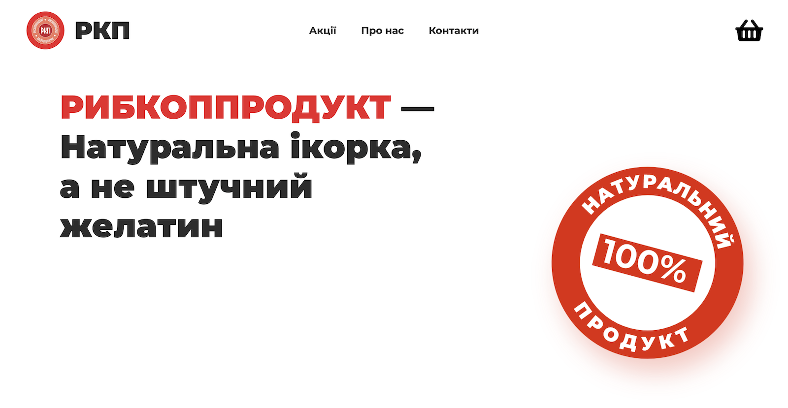

# RKP

> Product page for caviar company - [rkp.vercel.app](https://rkp.vercel.app)



## Getting Started

Install dependencies and run the app:

```bash
yarn && yarn dev
```

**Important!** Make sure you fill the [config file](.env)!

Open [http://localhost:3000](http://localhost:3000) with your browser to see the result.

## Design

Design is made in XD [> link](https://xd.adobe.com/view/deaf975d-1d4a-42e2-8310-06c74dad4f45-8bfc/)

### Author

**Paul Kotov** (paul@kotov.com.ua)

Made with love ❤️
